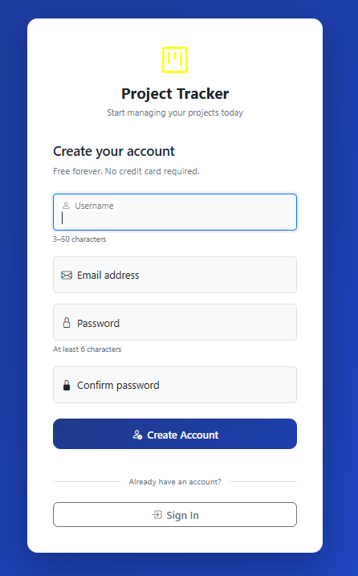
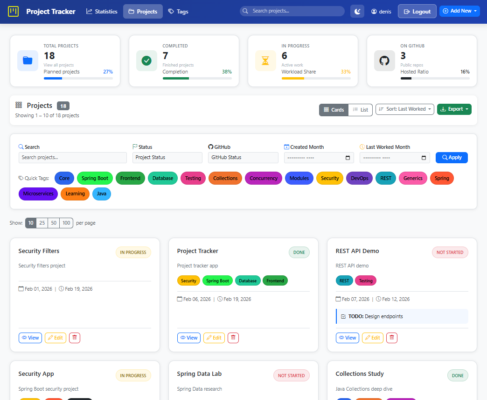
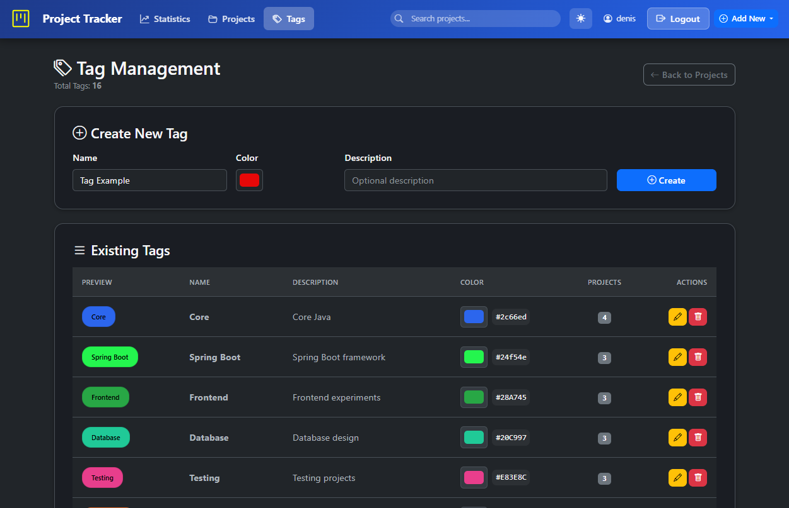
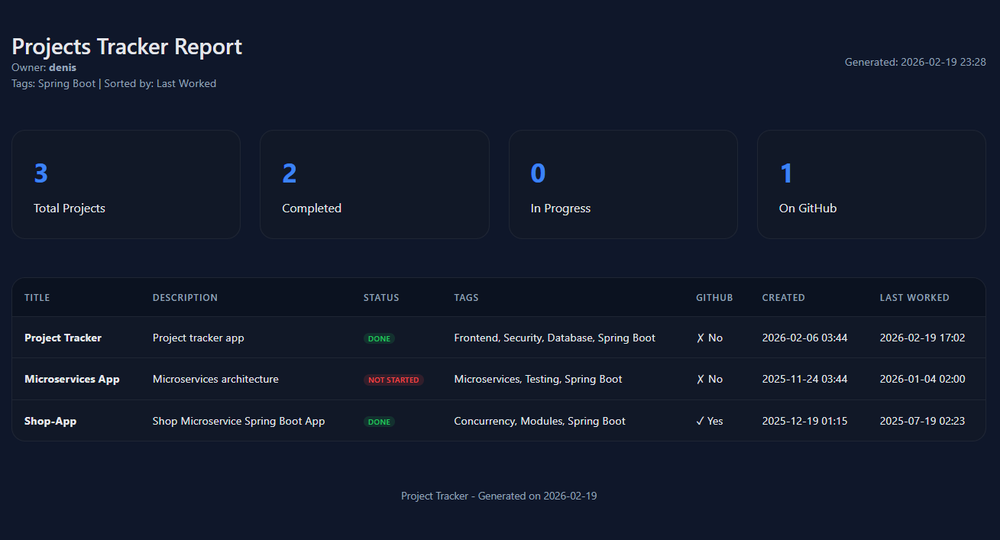

# 📊 Projects Tracker

**A modern, full-stack web application for managing personal projects with advanced filtering, tag management, export capabilities, multi-user support, built with Spring Boot and Thymeleaf.**

 
 
 

 
 

 
 

 
 

 
 

 


---


# Table of contents:

   * [**Introduction**](#introduction)
   * [**Problem Statement**](#problem-statement)
   * [**Project Goals**](#project-goals)
   * [**Use Cases**](#use-cases)
   * [**Key Features**](#key-features)
   * [**Technology Stack**](#technology-stack)
   * [**Check Potential Implementation Phases**](#check-potential-implementation-phases)
   * [**Project Structure**](#project-structure)
   * [**Data Model**](#data-model)
   * [**Getting Started**](#getting-started)
   * [**Testing**](#testing)
   * [**Usage**](#usage)
      * [**1. Register an Account**](#1-register-an-account)
      * [**2. Create Tags**](#2-create-tags)
      * [**3. Create a Project**](#3-create-a-project)
      * [**4. Filter and Search**](#4-filter-and-search)
      * [**5. View Statistics**](#5-view-statistics)
      * [**6. Export Data**](#6-export-data)
   * [**Security Features**](#security-features)
   * [**Configuration**](#configuration)
   * [**Troubleshooting (Common Issues)**](#troubleshooting-common-issues)
   * [**Deployment**](#deployment)
   * [**Performance**](#performance)
   * [**Author**](#author)
   * [**Screenshots**](#screenshots)

---

## **Introduction**

**Project Name:** Projects Tracker  
**Type:** Web Application  
**Purpose:** A centralized system to manage, track, and organize all your software projects

**What It Does:**
- Keeps track of all your projects in one place (local and GitHub)
- Manages project status (Not Started, In Progress, Done)
- Organizes projects with tags for easy filtering
- Tracks important dates (creation date, last worked on)
- Exports project data in multiple formats (CSV, HTML, Excel)
- Provides visual dashboard with statistics

---

## **Problem Statement**

**Current Situation:**
- You have ~28 projects scattered in a folder on your desktop
- Some projects are on GitHub, some are not
- Hard to remember which projects need work
- No easy way to filter projects by technology (Spring Boot, Kafka, Docker, etc.)
- No quick overview of project statuses
- Difficult to track when you last worked on a project

**What We Need:**
A simple, user-friendly web application that gives you full control over your project portfolio with easy CRUD operations, powerful filtering, and useful exports.

---

## **Project Goals**

### Primary Goals:
1. **Centralized Management** - Single place for all project information
2. **Easy CRUD Operations** - Create, Read, Update, Delete projects with simple UI
3. **Smart Filtering** - Find projects by tags, status, GitHub presence, dates
4. **Visual Dashboard** - Quick overview with statistics and clickable cards
5. **Tag Management** - Organize projects with reusable, managed tags
6. **Export Capabilities** - Generate reports in CSV, HTML, or Excel format

### Secondary Goals:
1. Clean, modern, responsive UI
2. Fast and efficient database queries
3. Easy to maintain and extend
4. Professional-looking exports

---

## **Use Cases**

### Use Case 1: Quick Project Overview
**Actor:** You (Developer)  
**Goal:** See all projects at a glance  
**Flow:**
1. Open the application
2. See dashboard with statistics cards (Total, Completed, In Progress, On GitHub)
3. Click on any stat card to filter projects instantly
4. View project cards with key information

### Use Case 2: Find Projects by Technology
**Actor:** You  
**Goal:** Find all Spring Boot projects  
**Flow:**
1. Open the application
2. Click on "Spring Boot" tag in the filter section
3. View only Spring Boot projects
4. Optionally export the list as CSV

### Use Case 3: Track Work Progress
**Actor:** You  
**Goal:** Update project status and add TODO notes  
**Flow:**
1. Find the project using search or filters
2. Click "Edit" button
3. Update status to "In Progress"
4. Add tasks in "What to Do" field
5. System automatically updates "Last Worked On" date

### Use Case 4: Add New Project
**Actor:** You  
**Goal:** Add a newly created project  
**Flow:**
1. Click "New Project" button
2. Fill in project details (title, description, status)
3. Select tags from existing tags or create new ones
4. Add GitHub URL if applicable
5. Save project

### Use Case 5: Organize with Tags
**Actor:** You  
**Goal:** Better organize projects with consistent tags  
**Flow:**
1. Click "Manage Tags" button
2. View all existing tags with project counts
3. Create new tags with custom colors
4. Rename or delete unused tags
5. Assign/remove tags from projects

### Use Case 6: Generate Reports
**Actor:** You  
**Goal:** Export Kafka projects for documentation  
**Flow:**
1. Filter projects by "Kafka" tag
2. Click "Export" dropdown
3. Choose "Export as HTML Report"
4. Download formatted HTML file with statistics
5. Share or archive the report

### Use Case 7: Find Stale Projects
**Actor:** You  
**Goal:** Find projects not worked on recently  
**Flow:**
1. Use "Last Worked" date filter
2. Set date to 3+ months ago
3. View projects that need attention
4. Update or archive as needed

---

## **Key Features**

### 🔐 **User Authentication & Authorization**
- Secure user registration and login
- BCrypt password encryption
- Session management with remember-me functionality
- Per-user data isolation (users cannot access each other's data)

### 📝 **Project Management**
- Create, read, update, and delete projects
- Track project status (Not Started, In Progress, Done)
- GitHub integration (track repository URLs)
- Local path tracking
- "What to do" notes for each project
- Last worked on timestamp tracking

### 🏷️ **Tag System**
- Create custom tags with colors
- Per-user tag uniqueness (different users can have tags with the same name)
- Assign multiple tags to projects
- Tag-based filtering and search
- Popularity-based tag sorting

### 🔍 **Advanced Filtering & Search**
- Filter by status (Not Started, In Progress, Done)
- Filter by GitHub/Local location
- Filter by tags (single or multiple)
- Filter by creation month
- Filter by last worked month
- Text search across project titles
- Combine multiple filters

### 📄 **Pagination**
- Customizable page sizes (10, 25, 50, 100 items per page)
- Smooth navigation between pages
- Persistent pagination state with filters

### 📊 **Statistics Dashboard**
- Projects by status (pie chart)
- GitHub vs Local distribution (doughnut chart)
- Projects created over time (line chart)
- Top 10 most used tags (bar chart)
- Activity heatmap (days since last worked)
- Completion rate percentage
- Average days since last worked
- [STATISTICS GUIDE](documentations/STATISTICS_GUIDE.md)

### 📤 **Export Functionality**
- Export to CSV (Excel-compatible)
- Export to HTML report
- Exports respect current filters
- Timestamped file names

### 🎨 **User Interface**
- Clean, modern design
- Dark mode support
- Responsive layout (mobile-friendly)
- Card/List view toggle
- Smooth animations and transitions
- Bootstrap 5 styling
- [TESTING UI SCENARIOS AS USER](documentations/TESTING_UI_SCENARIOS_AS_USER.md)

---

## **Technology Stack**

| Layer | Technology |
|-------|-----------|
| Backend | Spring Boot 3.5.10 |
| Security | Spring Security 6.x |
| Database | MySQL (Production) / H2 (Tests) |
| ORM | Spring Data JPA / Hibernate 6.x |
| Template Engine | Thymeleaf |
| Frontend | HTML5, CSS3, JavaScript |
| UI Framework | Bootstrap 5 |
| Charts | Chart.js |
| Build Tool | Maven |
| Testing | JUnit 5, Mockito, AssertJ |


---

## **Check Potential Implementation Phases**
[POTENTIAL IMPLEMENTATION PHASES](documentations/POTENTIAL_IMPLEMENTATION_PHASES.md)

---

## **Project Structure**

```
src/
├── main/
│   ├── java/com/vbforge/projectstracker/
│   │   ├── config/          # Security & app configuration
│   │   ├── controller/      # MVC controllers
│   │   ├── dto/             # Data Transfer Objects
│   │   ├── entity/          # JPA entities
│   │   ├── exception/       # Custom exceptions
│   │   ├── mapper/          # Entity ↔ DTO mappers
│   │   ├── repository/      # Spring Data repositories
│   │   ├── service/         # Business logic
│   │   └── util/            # Utility classes
│   └── resources/
│       ├── static/          # CSS, JS, images
│       ├── templates/       # Thymeleaf templates
│       └── application.properties
└── test/
    ├── java/com/vbforge/projectstracker/
    │   ├── controller/      # Controller tests (MockMvc)
    │   ├── dto/             # DTO validation tests
    │   ├── integration/     # Integration tests
    │   ├── mapper/          # Mapper tests
    │   ├── repository/      # Repository tests (@DataJpaTest)
    │   └── service/         # Service tests (Mockito)
    └── resources/
        └── application-test.properties
```

---

## **Data Model**

```
┌─────────────┐         ┌──────────────┐         ┌─────────────┐
│    User     │         │   Project    │         │     Tag     │
├─────────────┤         ├──────────────┤         ├─────────────┤
│ id          │────┐    │ id           │    ┌────│ id          │
│ username    │    │    │ title        │    │    │ name        │
│ email       │    │    │ description  │    │    │ color       │
│ password    │    │    │ status       │    │    │ description │
│ role        │    └───<│ owner_id     │>───┘    │ owner_id    │
│ created_at  │         │ on_github    │         │ created_date│
│ enabled     │         │ github_url   │         │ updated_at  │
└─────────────┘         │ local_path   │         └─────────────┘
                        │ what_todo    │               │
                        │ created_date │               │
                        │ last_worked  │               │
                        │ updated_at   │               │
                        └──────────────┘               │
                               │                       │
                               └───────────────────────┘
                                   Many-to-Many
                                (project_tags table)
```


**Security Design:**
- Every Project has an `owner_id` (foreign key to User)
- Every Tag has an `owner_id` (foreign key to User)
- All queries are scoped by owner (data isolation enforced at repository level)


### *Tables:*

#### 1. **projects**
Stores all project information
```
- id (PK, BIGINT, AUTO_INCREMENT)
- title (VARCHAR, NOT NULL)
- description (TEXT)
- status (ENUM: NOT_STARTED, IN_PROGRESS, DONE)
- on_github (BOOLEAN)
- github_url (VARCHAR)
- local_path (VARCHAR)
- what_todo (TEXT)
- created_date (TIMESTAMP)
- last_worked_on (TIMESTAMP)
- updated_at (TIMESTAMP)
```

#### 2. **tags**
Manages reusable tags
```
- id (PK, BIGINT, AUTO_INCREMENT)
- name (VARCHAR, UNIQUE, NOT NULL)
- color (VARCHAR) - Hex color code
- description (VARCHAR)
- created_date (TIMESTAMP)
- updated_at (TIMESTAMP)
```

#### 3. **project_tags**
Many-to-Many relationship (Junction table)
```
- project_id (FK to projects)
- tag_id (FK to tags)
- assigned_date (TIMESTAMP)
- PRIMARY KEY (project_id, tag_id)
```

### Relationships:
- One Project can have Many Tags (Many-to-Many)
- One Tag can be assigned to Many Projects (Many-to-Many)
- One User has Many Projects (one-to-many)
- One User has Many Tags (one-to-many)
- Many Projects have Many Tags (many-to-many)

### Indexes:
- Index on project status for filtering
- Index on on_github for filtering
- Index on dates for date-based queries
- Index on tag name for quick lookups

---

## **Getting Started**

### **Prerequisites**

- Java 17 or higher
- Maven 3.6+
- MySQL 8.0+ (for production)
- Git

### **Installation**

1. **Clone the repository**
   ```bash
   git clone https://github.com/yourusername/projects-tracker.git
   cd projects-tracker
   ```

2. **Configure the database**

   Create a MySQL database:
   ```sql
   CREATE DATABASE projects_tracker;
   CREATE USER 'tracker_user'@'localhost' IDENTIFIED BY 'your_password';
   GRANT ALL PRIVILEGES ON projects_tracker.* TO 'tracker_user'@'localhost';
   FLUSH PRIVILEGES;
   ```

3. **Update application.properties**

   Edit `src/main/resources/application.properties`:
   ```properties
   spring.datasource.url=jdbc:mysql://localhost:3306/projects_tracker
   spring.datasource.username=tracker_user
   spring.datasource.password=your_password
   ```

4. **Build the project**
   ```bash
   mvn clean install
   ```

5. **Run the application**
   ```bash
   mvn spring-boot:run
   ```

6. **Access the application**
   
   Open your browser and navigate to:
   ```
   http://localhost:8080
   ```

---

## **Testing**

The project includes **~164 comprehensive tests** with **~85% code coverage**.

### **Test Structure**

| Layer | Tests    | Description |
|-------|----------|-------------|
| **Repository** | ~41      | Database queries, data isolation |
| **Mapper** | ~15      | Entity ↔ DTO conversions |
| **DTO** | ~15      | Validation rules |
| **Service** | ~41      | Business logic |
| **Controller** | ~31      | HTTP endpoints (MockMvc) |
| **Integration** | ~21      | Full stack end-to-end |
| **TOTAL** | **~164** | **Comprehensive coverage** |

### **Running Tests**

```bash
# Run all tests
mvn test

# Run specific test class
mvn test -Dtest=UserServiceImplTest

# Run all integration tests
mvn test -Dtest="*IntegrationTest"

# Run with coverage report
mvn test jacoco:report
# View report at: target/site/jacoco/index.html
```

### **Test Profiles**

Tests use an H2 in-memory database configured in `src/test/resources/application-test.properties`:

```properties
spring.datasource.url=jdbc:h2:mem:testdb
spring.jpa.hibernate.ddl-auto=create-drop
```

---

## **Usage**

### **1. Register an Account**

Navigate to `/register` and create your account with:
- Username (3-50 characters)
- Email (valid format)
- Password (minimum 6 characters)

### **2. Create Tags**

Before creating projects, set up your tags:
1. Go to "Tags" page
2. Click "Create New Tag"
3. Enter name, choose color, add description
4. Save

Example tags: `Spring Boot`, `React`, `Docker`, `Machine Learning`

### **3. Create a Project**

1. Go to "Dashboard" → "Create New Project"
2. Fill in details:
   - Title (required)
   - Description
   - Status (Not Started, In Progress, Done)
   - Tags (select multiple)
   - GitHub URL (if applicable)
   - Local path (if applicable)
   - What to do next
3. Save

### **4. Filter and Search**

Use the filter bar to find projects:
- **Status**: Filter by completion status
- **Location**: GitHub or Local projects
- **Tags**: Single or multiple tag selection
- **Month**: Created or last worked month
- **Search**: Text search in titles
- **Sort**: By last worked, created date, or title

### **5. View Statistics**

Navigate to `/statistics` to see:
- Project completion rate
- Distribution charts
- Activity timeline
- Most used tags
- Days since last worked

### **6. Export Data**

Click "Export" to download:
- **CSV**: Import into Excel/Google Sheets
- **HTML**: Printable report with charts

---

## **Security Features**

### **Authentication**
- BCrypt password hashing (cost factor: 10)
- Session-based authentication
- Remember-me functionality (30-day token validity)
- CSRF protection enabled

### **Authorization**
- Role-based access control (USER role)
- Per-user data isolation
- Owner-scoped repository queries
- Secure password storage

### **Data Isolation**
Every query is scoped by owner:

```
// Example: User 1 cannot access User 2's projects
projectRepository.findByIdAndOwner(projectId, currentUser);
// Returns empty if project belongs to different user
```

### **SQL Injection Prevention**
- Spring Data JPA parameterized queries
- No raw SQL concatenation
- Prepared statements

---

## **Configuration**

### **Application Properties**

Key configuration options in `application.properties`:

```properties
# Server
server.port=8080

# Database
spring.datasource.url=jdbc:mysql://localhost:3306/projects_tracker
spring.datasource.username=your_username
spring.datasource.password=your_password

# JPA
spring.jpa.hibernate.ddl-auto=update
spring.jpa.show-sql=false

# Security
# Remember-me token validity (seconds)
spring.security.remember-me.token-validity-seconds=2592000

# Logging
logging.level.com.vbforge.projectstracker=INFO
```

### **Environment Variables**

For production, use environment variables:

```bash
export DB_URL=jdbc:mysql://prod-server:3306/projects_tracker
export DB_USERNAME=prod_user
export DB_PASSWORD=secure_password
```

Then reference in application.properties:
```properties
spring.datasource.url=${DB_URL}
spring.datasource.username=${DB_USERNAME}
spring.datasource.password=${DB_PASSWORD}
```

---

## **Troubleshooting (Common Issues)**

#### **Database Connection Failed**
```
Error: Communications link failure
```
**Solution**: 
1. Verify MySQL is running: `sudo systemctl status mysql`
2. Check connection details in `application.properties`
3. Test connection: `mysql -u tracker_user -p`

#### **Port Already in Use**
```
Error: Port 8080 is already in use
```
**Solution**: Change port in `application.properties`:
```properties
server.port=8081
```

#### **Tests Fail with "No PasswordEncoder Bean"**
```
Error: No qualifying bean of type 'PasswordEncoder'
```
**Solution**: Ensure `TestSecurityConfig.java` is in `src/test/java/.../config/`

#### **Foreign Key Constraint Violation**
```
Error: Cannot delete tag with associated projects
```
**Solution**: Remove tag from all projects before deleting, or use cascade delete

---

## **Deployment**

### **Production Checklist**

- Set `spring.jpa.hibernate.ddl-auto=validate` (not `update`)
- Use strong database credentials
- Enable HTTPS (SSL/TLS certificates)
- Set `spring.jpa.show-sql=false`
- Configure proper logging levels
- Set up database backups
- Configure connection pooling (HikariCP)
- Set up monitoring (actuator endpoints)
- Use environment variables for secrets
- Enable GZIP compression

### **Docker Deployment** (Optional)

Create `Dockerfile`:
```dockerfile
FROM openjdk:17-jdk-slim
WORKDIR /app
COPY target/projects-tracker-0.0.1-SNAPSHOT.jar app.jar
EXPOSE 8080
ENTRYPOINT ["java", "-jar", "app.jar"]
```

Build and run:
```bash
mvn clean package
docker build -t projects-tracker .
docker run -p 8080:8080 projects-tracker
```

---

## **Performance**

### **Optimizations Implemented**

- **Database**: Indexed foreign keys (owner_id)
- **Queries**: FetchType.EAGER only where needed
- **Pagination**: Server-side pagination (prevents loading all data)
- **Caching**: Second-level cache disabled (consistency over speed)
- **Connection Pooling**: HikariCP (default in Spring Boot)

### **Benchmarks** (Local MySQL)

| Operation | Response Time |
|-----------|---------------|
| Dashboard load (50 projects) | ~150ms |
| Create project | ~50ms |
| Filter + search | ~100ms |
| Export CSV (100 projects) | ~200ms |
| Statistics dashboard | ~250ms |

---

## **Author**

**`vbforge`**
- [GITHUB](https://github.com/vbforge)
- [LINKEDIN](https://www.linkedin.com/in/vlad-bogdantsev-7897662b2/)

---

## **Screenshots**

### Login


### Register


### Dashboard table


### Dashboard cards


### Dashboard cards (light mode)


### Tag Management


### Project Card


### Statistics


### HTML Report example


---
