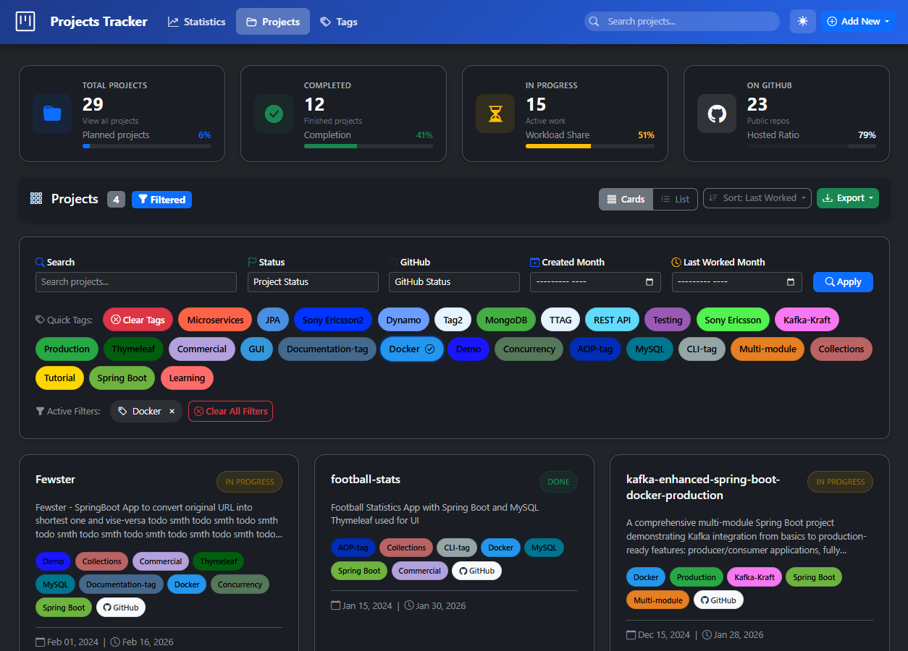
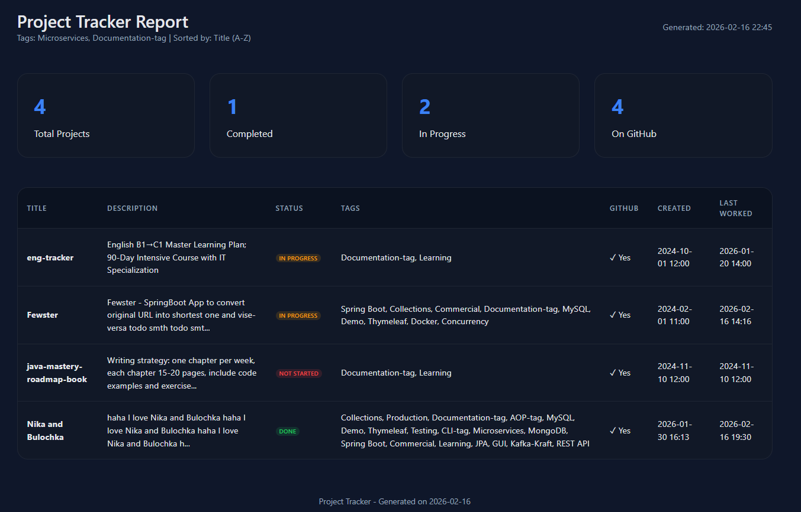

# Projects Tracker

**A full-stack web application for managing software development projects with advanced filtering, tag management, and export capabilities.**

- 📊 Dashboard with real-time statistics
- 🔍 Advanced search and filtering
- 🏷️ Tag management with custom colors
- ✏️ Full CRUD operations
- 📥 Export to CSV and HTML
- 📱 Responsive design
- 🌓 Dark/Light modes

---



---



---

## 📋 Table of Contents

* [🎯 Project Introduction](#-project-introduction)
* [🤔 Problem Statement](#-problem-statement)
* [🎯 Project Goals](#-project-goals)
* [📚 Use Cases](#-use-cases)
* [🛠️ Technology Stack](#-technology-stack)
* [🗄️ Database Design](#-database-design)
* [✨ Key Features](#-key-features)
* [🏗️ Implementation Phases](#-implementation-phases):
    * [**PHASE 1: Project Setup & Database** ⚙️](#phase-1-project-setup--database-)
    * [**PHASE 2: Repository & Service Layer** 🔄](#phase-2-repository--service-layer-)
    * [**PHASE 3: Basic Controller & Views** 🎨](#phase-3-basic-controller--views-)
    * [**PHASE 4: CRUD Operations** ✏️](#phase-4-crud-operations-)
    * [**PHASE 5: Filtering & Tag Management** 🔍](#phase-5-filtering--tag-management-)
    * [**PHASE 6: Export Functionality** 📊](#phase-6-export-functionality-)
* [📁 Project Structure](#-project-structure)
* [🚀 Future Enhancements](#-future-enhancements)
* [🎯 Success Criteria](#-success-criteria)
* [📚 Learning Outcomes](#-learning-outcomes)
* [📋 About](#-about)

---

## 🎯 Project Introduction

**Project Name:** Projects Tracker  
**Type:** Web Application  
**Purpose:** A centralized system to manage, track, and organize all your software projects

**What It Does:**
- Keeps track of all your projects in one place (local and GitHub)
- Manages project status (Not Started, In Progress, Done)
- Organizes projects with tags for easy filtering
- Tracks important dates (creation date, last worked on)
- Exports project data in multiple formats (CSV, HTML, Excel)
- Provides visual dashboard with statistics

---

## 🤔 Problem Statement

**Current Situation:**
- You have ~28 projects scattered in a folder on your desktop
- Some projects are on GitHub, some are not
- Hard to remember which projects need work
- No easy way to filter projects by technology (Spring Boot, Kafka, Docker, etc.)
- No quick overview of project statuses
- Difficult to track when you last worked on a project

**What We Need:**
A simple, user-friendly web application that gives you full control over your project portfolio with easy CRUD operations, powerful filtering, and useful exports.

---

## 🎯 Project Goals

### Primary Goals:
1. **Centralized Management** - Single place for all project information
2. **Easy CRUD Operations** - Create, Read, Update, Delete projects with simple UI
3. **Smart Filtering** - Find projects by tags, status, GitHub presence, dates
4. **Visual Dashboard** - Quick overview with statistics and clickable cards
5. **Tag Management** - Organize projects with reusable, managed tags
6. **Export Capabilities** - Generate reports in CSV, HTML, or Excel format

### Secondary Goals:
1. Clean, modern, responsive UI
2. Fast and efficient database queries
3. Easy to maintain and extend
4. Professional-looking exports

---

## 📚 Use Cases

### Use Case 1: Quick Project Overview
**Actor:** You (Developer)  
**Goal:** See all projects at a glance  
**Flow:**
1. Open the application
2. See dashboard with statistics cards (Total, Completed, In Progress, On GitHub)
3. Click on any stat card to filter projects instantly
4. View project cards with key information

### Use Case 2: Find Projects by Technology
**Actor:** You  
**Goal:** Find all Spring Boot projects  
**Flow:**
1. Open the application
2. Click on "Spring Boot" tag in the filter section
3. View only Spring Boot projects
4. Optionally export the list as CSV

### Use Case 3: Track Work Progress
**Actor:** You  
**Goal:** Update project status and add TODO notes  
**Flow:**
1. Find the project using search or filters
2. Click "Edit" button
3. Update status to "In Progress"
4. Add tasks in "What to Do" field
5. System automatically updates "Last Worked On" date

### Use Case 4: Add New Project
**Actor:** You  
**Goal:** Add a newly created project  
**Flow:**
1. Click "New Project" button
2. Fill in project details (title, description, status)
3. Select tags from existing tags or create new ones
4. Add GitHub URL if applicable
5. Save project

### Use Case 5: Organize with Tags
**Actor:** You  
**Goal:** Better organize projects with consistent tags  
**Flow:**
1. Click "Manage Tags" button
2. View all existing tags with project counts
3. Create new tags with custom colors
4. Rename or delete unused tags
5. Assign/remove tags from projects

### Use Case 6: Generate Reports
**Actor:** You  
**Goal:** Export Kafka projects for documentation  
**Flow:**
1. Filter projects by "Kafka" tag
2. Click "Export" dropdown
3. Choose "Export as HTML Report"
4. Download formatted HTML file with statistics
5. Share or archive the report

### Use Case 7: Find Stale Projects
**Actor:** You  
**Goal:** Find projects not worked on recently  
**Flow:**
1. Use "Last Worked" date filter
2. Set date to 3+ months ago
3. View projects that need attention
4. Update or archive as needed

---

## 🛠️ Technology Stack

### Backend:
- **Java 17** - Modern Java with latest features
- **Spring Boot 3.x** - Application framework
    - Spring Web - REST endpoints and MVC
    - Spring Data JPA - Database abstraction
    - Spring Boot DevTools - Development productivity
- **Hibernate** - ORM for database operations
- **Lombok** - Reduce boilerplate code
- **Bean Validation** - Input validation

### Frontend:
- **Thymeleaf** - Server-side template engine
- **HTML5 & CSS3** - Structure and styling
- **Bootstrap 5** - Responsive UI framework
- **Bootstrap Icons** - Icon library
- **Vanilla JavaScript** - Minimal client-side logic

### Database:
- **MySQL 8.0+** - Relational database
- Proper indexing for performance
- Foreign key constraints for data integrity

### Build Tool:
- **Maven** - Dependency management and build

### Optional (for Excel export):
- **Apache POI** - Excel file generation

---

## 🗄️ Database Design

### Tables:

#### 1. **projects**
Stores all project information
```
- id (PK, BIGINT, AUTO_INCREMENT)
- title (VARCHAR, NOT NULL)
- description (TEXT)
- status (ENUM: NOT_STARTED, IN_PROGRESS, DONE)
- on_github (BOOLEAN)
- github_url (VARCHAR)
- local_path (VARCHAR)
- what_todo (TEXT)
- created_date (TIMESTAMP)
- last_worked_on (TIMESTAMP)
- updated_at (TIMESTAMP)
```

#### 2. **tags**
Manages reusable tags
```
- id (PK, BIGINT, AUTO_INCREMENT)
- name (VARCHAR, UNIQUE, NOT NULL)
- color (VARCHAR) - Hex color code
- description (VARCHAR)
- created_date (TIMESTAMP)
- updated_at (TIMESTAMP)
```

#### 3. **project_tags**
Many-to-Many relationship (Junction table)
```
- project_id (FK to projects)
- tag_id (FK to tags)
- assigned_date (TIMESTAMP)
- PRIMARY KEY (project_id, tag_id)
```

### Relationships:
- One Project can have Many Tags (Many-to-Many)
- One Tag can be assigned to Many Projects (Many-to-Many)

### Indexes:
- Index on project status for filtering
- Index on on_github for filtering
- Index on dates for date-based queries
- Index on tag name for quick lookups

---

## ✨ Key Features

### 1. Dashboard
- **Statistics Cards** (clickable to filter)
    - Total Projects
    - Completed Projects
    - In Progress Projects
    - Projects on GitHub
- **Visual Design** with hover effects

### 2. CRUD Operations
- **Create:** Add new projects with modal form
- **Read:** View all projects with pagination
- **Update:** Edit project details, status, tags
- **Delete:** Remove projects with confirmation

### 3. Advanced Filtering
- Search by project name (text search)
- Filter by status (dropdown)
- Filter by GitHub presence (dropdown)
- Filter by creation month (date picker)
- Filter by last worked month (date picker)
- Quick filter by tag (clickable tags)
- Combine multiple filters

### 4. Tag Management
- Create new tags with custom colors
- View all tags with project counts
- Edit tag names and colors
- Delete unused tags
- Auto-complete when assigning tags

### 5. Export Functionality
- **CSV Export:** Plain data file for spreadsheets
- **HTML Export:** Formatted report with statistics and table
- **Excel Export:** Professional spreadsheet (optional)
- Export options:
    - Current filtered view
    - All projects
    - Projects by specific tag
    - Projects by status

### 6. Smart UI Features
- Responsive design (works on mobile, tablet, desktop)
- Color-coded status badges
- GitHub indicator badges
- Tag badges (clickable for filtering)
- TODO alerts on project cards
- Date formatting
- Empty state messages
- Loading indicators

---

## 🏗️ Implementation Phases

Build this project in **6 manageable phases**, step-by-step.


### **PHASE 1: Project Setup & Database** ⚙️

**Goal:** Set up the project structure and database foundation

### Steps:
1. **Create Spring Boot Project**
    - Use Spring Initializr or IDE
    - Add dependencies (Web, JPA, MySQL, Lombok, DevTools, Thymeleaf)
    - Configure `application.properties`

2. **Set Up MySQL Database**
    - Create database schema
    - Run SQL script to create tables
    - Insert sample tags
    - Insert your existing projects

3. **Create Entity Classes**
    - Project entity with JPA annotations
    - Tag entity with JPA annotations
    - ProjectStatus enum
    - Configure relationships (Many-to-Many)

4. **Test Database Connection**
    - Verify application starts
    - Check database tables created
    - Verify sample data inserted

**Deliverables:**
- ✅ Working Spring Boot application
- ✅ Database with tables and sample data
- ✅ Entity classes with proper relationships

---

### **PHASE 2: Repository & Service Layer** 🔄

**Goal:** Create data access and business logic layers

### Steps:
1. **Create Repositories**
    - ProjectRepository (Spring Data JPA)
    - TagRepository (Spring Data JPA)
    - Add custom query methods

2. **Create Service Classes**
    - ProjectService (business logic)
    - TagService (tag management)
    - Implement CRUD methods
    - Add filtering logic

3. **Create DTOs (if needed)**
    - ProjectDTO for data transfer
    - TagDTO for API responses

4. **Write Unit Tests** (optional for now)
    - Test repository methods
    - Test service logic

**Deliverables:**
- ✅ Repository interfaces with custom queries
- ✅ Service classes with business logic
- ✅ Tested CRUD operations

---

### **PHASE 3: Basic Controller & Views** 🎨

**Goal:** Create basic web interface with project listing

### Steps:
1. **Create ProjectController**
    - GET `/` or `/projects` - List all projects
    - Add model attributes (projects, statistics)

2. **Create Dashboard View (Thymeleaf)**
    - Create `dashboard.html` template
    - Display statistics cards
    - Display project cards (grid layout)
    - Use Bootstrap for styling

3. **Test Basic Flow**
    - Start application
    - Open browser to localhost:8080
    - Verify projects displayed
    - Verify statistics shown

**Deliverables:**
- ✅ Working dashboard page
- ✅ Project cards displaying correctly
- ✅ Statistics cards showing accurate numbers

---

### **PHASE 4: CRUD Operations** ✏️

**Goal:** Implement full Create, Read, Update, Delete functionality

### Steps:
1. **Create Project - Add Endpoints**
    - GET `/projects/new` - Show form
    - POST `/projects/add` - Save new project

2. **Create Add/Edit Forms**
    - Modal form for adding projects
    - Form for editing projects
    - Tag selection (multi-select)

3. **Update Project - Add Endpoints**
    - GET `/projects/{id}/edit` - Show edit form
    - POST `/projects/{id}/update` - Update project

4. **Delete Project - Add Endpoint**
    - POST `/projects/{id}/delete` - Delete project
    - Add confirmation dialog (JavaScript)

5. **View Project Details**
    - GET `/projects/{id}` - View single project
    - Show all details, tags, dates

**Deliverables:**
- ✅ Ability to add new projects
- ✅ Ability to edit existing projects
- ✅ Ability to delete projects
- ✅ Ability to view project details

---

### **PHASE 5: Filtering & Tag Management** 🔍

**Goal:** Implement advanced filtering and tag management

### Steps:
1. **Implement Filtering Logic**
    - Add search by name
    - Add filter by status
    - Add filter by GitHub presence
    - Add filter by date (created, last worked)
    - Add filter by tag (clickable tags)
    - Make statistics cards clickable

2. **Create Tag Management**
    - GET `/tags` - List all tags
    - POST `/tags/create` - Create new tag
    - POST `/tags/{id}/update` - Update tag
    - POST `/tags/{id}/delete` - Delete tag
    - Modal for tag management

3. **Enhance UI**
    - Add filter section
    - Add clickable tag badges
    - Add "Clear Filters" button
    - Show active filters
    - Show results count

4. **Add Pagination**
    - Implement pagination for project list
    - Add page navigation controls

**Deliverables:**
- ✅ Working search and filters
- ✅ Clickable statistics cards
- ✅ Tag management interface
- ✅ Clickable tag filters
- ✅ Pagination

---

### **PHASE 6: Export Functionality** 📊

**Goal:** Implement data export in multiple formats

### Steps:
1. **Create ExportService**
    - Method for CSV export
    - Method for HTML export
    - Method for Excel export (optional)

2. **Create Export Endpoints**
    - GET `/projects/export/csv` - Export as CSV
    - GET `/projects/export/html` - Export as HTML
    - GET `/projects/export/excel` - Export as Excel
    - Support filtering parameters

3. **Implement Export by Tag**
    - Export all projects with specific tag
    - Modal for selecting tag and format

4. **Add Export UI**
    - Export dropdown button
    - Options for different formats
    - Export current view
    - Export all projects
    - Export by tag

5. **Test Exports**
    - Test CSV generation
    - Test HTML report generation
    - Test with filtered data
    - Test with all data

**Deliverables:**
- ✅ CSV export working
- ✅ HTML export with statistics
- ✅ Export by tag working
- ✅ Download functionality

---

## 📁 Project Structure

```
projects-tracker/
├── src/
│   ├── main/
│   │   ├── java/
│   │   │   └── com/vbforge/projectstracker/
│   │   │       ├── ProjectsTrackerApplication.java
│   │   │       ├── controller/
│   │   │       │   ├── ProjectController.java
│   │   │       │   ├── TagController.java
│   │   │       │   └── ExportController.java
│   │   │       ├── model/
│   │   │       │   ├── Project.java
│   │   │       │   ├── Tag.java
│   │   │       │   └── ProjectStatus.java (enum)
│   │   │       ├── repository/
│   │   │       │   ├── ProjectRepository.java
│   │   │       │   └── TagRepository.java
│   │   │       ├── service/
│   │   │       │   ├── ProjectService.java
│   │   │       │   ├── TagService.java
│   │   │       │   └── ExportService.java
│   │   │       └── dto/
│   │   │           ├── ProjectDTO.java
│   │   │           └── TagDTO.java
│   │   └── resources/
│   │       ├── templates/
│   │       │   ├── dashboard.html
│   │       │   ├── project-detail.html
│   │       │   ├── project-edit.html
│   │       │   └── fragments/
│   │       │       ├── header.html
│   │       │       └── footer.html
│   │       ├── static/
│   │       │   ├── css/
│   │       │   │   └── custom.css
│   │       │   └── js/
│   │       │       └── main.js
│   │       ├── application.properties
│   │       └── schema.sql
│   └── test/
│       └── java/
│           └── com/vbforge/projecttracker/
│               ├── service/
│               └── repository/
├── pom.xml
└── README.md
```

---

## 🚀 Future Enhancements

Ideas for after the main project is complete:

1. **Project advanced developing**
    - Global Exception Handler implementation
    - Mappers for DTO`s
    - Integration testing

2. **GitHub Integration**
    - Fetch repository info from GitHub API
    - Display stars, forks, last commit date
    - Auto-update project status based on commits

3. **Advanced Analytics**
    - Time spent on projects
    - Productivity charts
    - Tag popularity over time

4. **Collaboration Features**
    - Share project lists with team
    - Comments on projects
    - Assignment of tasks

5. **Search Improvements**
    - Full-text search
    - Search in descriptions
    - Search in TODO notes

6. **Backup & Sync**
    - Auto-backup to cloud
    - Sync across devices
    - Import/Export full database

7. **REST API**
    - RESTful API for external access
    - API documentation with Swagger
    - Authentication with JWT

---

## 🎯 Success Criteria

The project will be considered complete when:

- ✅ All ~28 projects are in the database
- ✅ Can add, edit, delete projects easily
- ✅ Can filter by status, tags, dates, GitHub
- ✅ Dashboard shows accurate statistics
- ✅ Tags are managed in separate table
- ✅ Can create and manage tags
- ✅ Can export to CSV and HTML
- ✅ UI is clean, responsive, and user-friendly
- ✅ Application runs without errors

---

## 📚 Learning Outcomes

By building this project, you'll learn/practice:

1. **Spring Boot fundamentals**
    - Project structure
    - Configuration
    - Dependency injection

2. **JPA & Hibernate**
    - Entity relationships
    - Many-to-Many mappings
    - Query methods

3. **MVC Pattern**
    - Controllers
    - Services
    - Repositories

4. **Thymeleaf**
    - Template syntax
    - Conditionals and loops
    - Form handling

5. **Database Design**
    - Normalization
    - Foreign keys
    - Junction tables

6. **Web Development**
    - HTML/CSS
    - Bootstrap
    - Responsive design

7. **File Generation**
    - CSV export
    - HTML generation
    - Excel creation (optional)

---

## Getting Started Fast
1. Clone the repository
2. Create MySQL database: `project_tracker`
3. Configure database credentials in `.env`
4. Run the application
5. Access at `http://localhost:8080`

---

## 📋 About:

* **Author:** `vbforge`:
    * [LINKEDIN](https://www.linkedin.com/in/vlad-bogdantsev-7897662b2/)
    * [GITHUB](https://github.com/vbforge)
* **Date:** January 29, 2026
* **Version:** 1.0
* **Status:** Ongoing

---

#### P.S. [for banner](https://patorjk.com/software/taag/#p=display&f=Big+Money-se&t=VBFORGE-PROJECTS&x=none&v=4&h=4&w=80&we=false)

